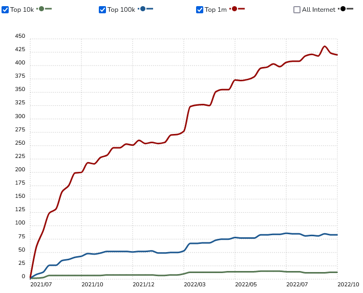

# What is Flutter

Flutter is an open source framework built on top of [Dart Language](/docs/flutter/what-is-dart.md) developed by Google launched in May 2017. It allows developers to build high-quality, natively compiled applications for mobile, web , desktop, smart TVs and Embeded devices(Raspberry Pi and Iot Devices).

## Analytics




* More than 36,889 projects were built with Flutter and have been downloaded over 11 Billion times.
* As of February 2023, Flutter has 487,428 repository results this number almost doubled as in 2022
* As of April 2023, Flutter has about [152K Stars](https://github.com/flutter/flutter) on Github and has about [159,751](https://stackoverflow.com/questions/tagged/flutter) questions asked on Stackoverflow

Get started by **creating a new site**.

Or **try Docusaurus immediately** with **[docusaurus.new](https://docusaurus.new)**.

### What you'll need

- [Node.js](https://nodejs.org/en/download/) version 16.14 or above:
  - When installing Node.js, you are recommended to check all checkboxes related to dependencies.

## Generate a new site

Generate a new Docusaurus site using the **classic template**.

The classic template will automatically be added to your project after you run the command:

```bash
npm init docusaurus@latest my-website classic
```

You can type this command into Command Prompt, Powershell, Terminal, or any other integrated terminal of your code editor.

The command also installs all necessary dependencies you need to run Docusaurus.

## Start your site

Run the development server:

```bash
cd my-website
npm run start
```

The `cd` command changes the directory you're working with. In order to work with your newly created Docusaurus site, you'll need to navigate the terminal there.

The `npm run start` command builds your website locally and serves it through a development server, ready for you to view at http://localhost:3000/.

Open `docs/intro.md` (this page) and edit some lines: the site **reloads automatically** and displays your changes.
